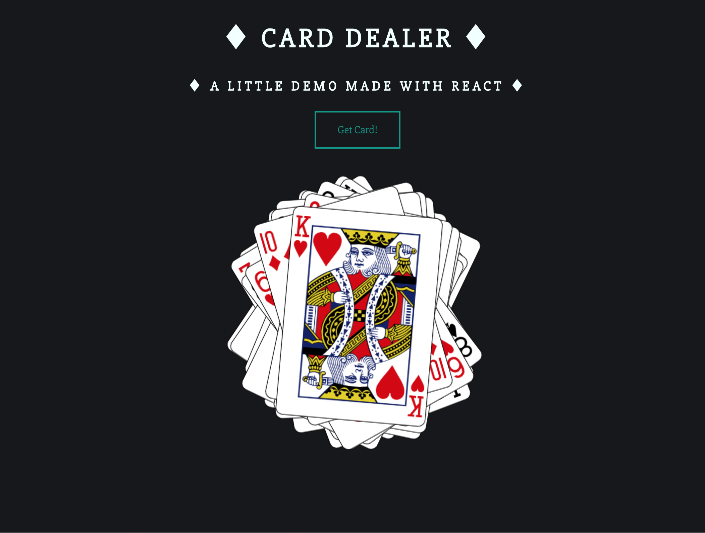

# Deck of Cards

### Description

This project aims to practice React LifeCycle Methods and use an API. The goal is to build an app that displays a deck of cards, one card at a time.

The different tasks to complete are:

- When the page loads, send a request to [https://deckofcardsapi.com/api/deck/new/shuffle](https://deckofcardsapi.com/api/deck/new/shuffle) to create a new deck

- Store the Deck ID it gives you, so you can make further requests to retreive each card image

- Add a button to your app that allows a user to draw a new card

- When a user clicks the button, send another request this time to [https://deckofcardsapi.com/api/deck/${deck_id}/draw/](https://deckofcardsapi.com/api/deck/${deck_id}/draw/) using the Deck ID

- Use the data included in the response to display a new card image, and make sure to include an informative alt attribute

- Every time the user clicks, the app should display a new card until the deck is empty. Make sure to tell the user there are no cards left!

The app displays an interface that looks like this:

### Technologies

*Languages:* Javascript, HTML, CSS

*Library:* React

### Key features

* Clicking on a button allows the user to draw a card

* The cards display on top of each others

* The user is notified when there are no cards left

### Poject status

The project is just started.

### Credits & Sources

* Another small project from [The Modern React Bootcamp](https://www.udemy.com/course/modern-react-bootcamp)
